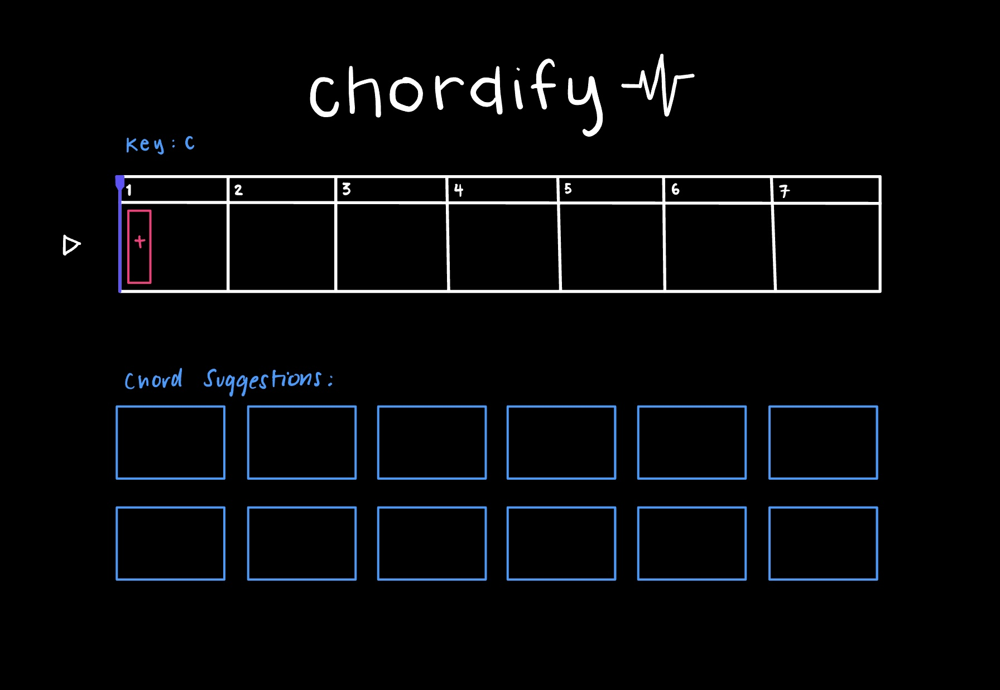
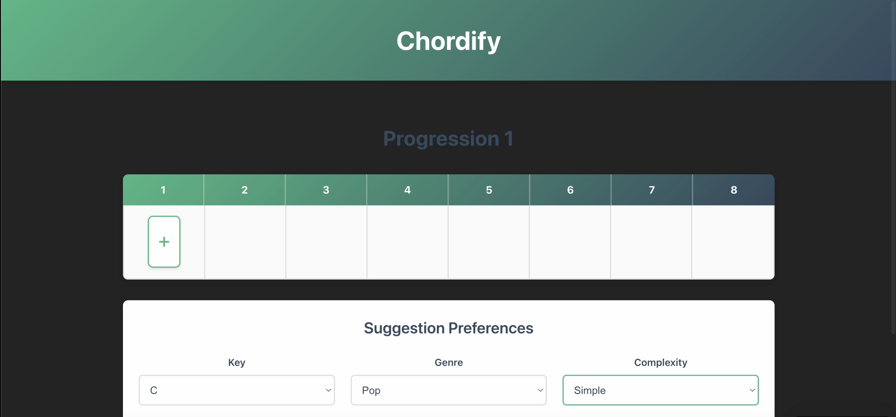
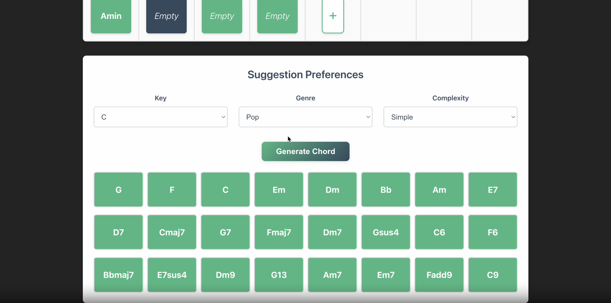
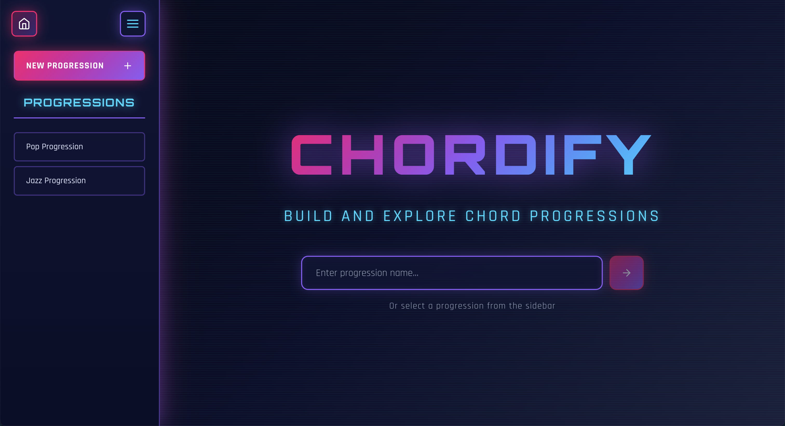
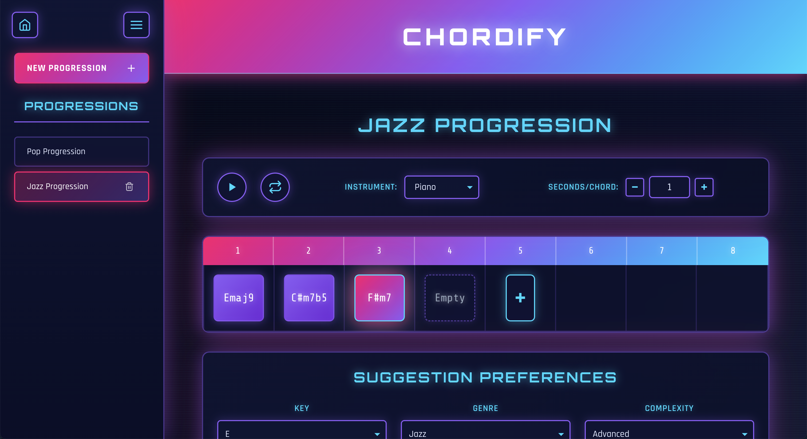

# Design Document

## Concept Design
### Original Concept Design
[@original-play-back-concept](context/design/concepts/PlayBack/concept.md/steps/concept.707461cd.md)  
[@original-progression-builder-concept](context/design/concepts/ProgressionBuilder/concept.md/steps/concept.8a783632.md)  
[@original-suggest-chord-concept](context/design/concepts/SuggestChord/concept.md/steps/concept.c611bcd4.md)
### Final Concept Design
[@final-play-back-concept](context/design/concepts/PlayBack/PlayBackSpec.md/steps/concept.2033187e.md)  
[@final-progression-builder-concept](context/design/concepts/ProgressionBuilder/ProgressionBuilderSpec.md/steps/concept.dd8826a1.md)  
[@final-suggest-chord-concept](context/design/concepts/SuggestChord/SuggestChordSpec.md/steps/concept.556f58a4.md)

### Major Design Changes
1. **Users can create multiple progressions**
One of the largest design changes I decided to make was to allow users to create multiple progressions. The original design of the application only had one progression builder page, but now the user can create multiple progressions with different settings and these progressions persist between user sessions. I made this change because as a user I would like the ability to make multiple progressions, and I also thought that the project scope was a little narrow without this feature. This also leveraged more use case for the database, now that it stores multiple progressions instead of just one.
2. **PlayBack and SuggestChord Concepts now hold state**  
The original concepts for PlayBack and SuggestChord were very bare bones and did not hold any state. Although the PlayBack concept has the chord progression as its state, it also took in a chord progression to its `playSequence` function, essentially making the state redundant, and also reliant on the ProgressionBuilder state. For SuggestChord, the original state was also the progression and also the key, but it had the same issue as PlayBack where the actual suggestion function was taking in a chord. Upon reviewing my concept designs and the concept design specification document, I realized that these two concepts were not really modular as they depended on ProgressionBuilder state and did not hold much state of their own. To remedy that, I introduced some expanded features for each of the concepts that were specific to that concepts only and allowed for them to hold state, while also expanding the customizability for the user. For PlayBack, I introduced `instrument` and `secondsPerChord` per progression so that the user could customize the play back. For SuggestChord, I introduced `genre`, `complexity`, and `key` so that the user could customize the chord suggestion. Coupled with change (1), both of these concepts now have their own state that is very modular to their functionality, and also the application is improved due to the customizability of the user.
3. **Removal of `selectedSlotIdx` and expanded functionality for ProgressionBuilder**
A major change to the ProgressionBuilder concept was the removal of the `selectedSlotIdx` in favor for a `position` variable being passed in when appropriate. The major reason for this design change was that with change (1), the concept referred to multiple progressions at once, so it didn't make sense to have a `selectedSlotIdx` for the concept. Additionally, only some of the functions needed that information, so I thought it was better to just pass it in when appropriate. Additionally, I added more functionality to this concept that I thought would be useful as a user. The user is now able to rename their progression, delete the progression, and reorder slots in the progression.

## Visual Design
### Original Visual Design

### Intermediate Visual Design

### Final Visual Design

The visual design for the up to the intermediate UI focused solely on functionality. Because originally my project was more narrowly scoped, I did not plan for PlayBack setting and SuggestChord preferences to be in the UI. For the intermediate design, I had not yet added functionality for multiple progressions or styling, but much of the ProgressionBuilder page looks the same structure wise as the Final. For the Final, I added a home page and a side bar to support navigation to different progressions and creation of new progressions. I made the website cyberpunk themed, with a dark background and bright accent colors and glow effects and futuristic fonts.